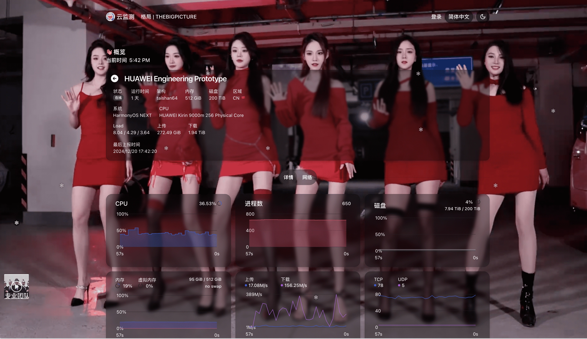

<div align="center">
  <br>
  <h1 align="center" style="color:red"> Fake Nezha Agent V1</h1>
  <h2>origin :  https://github.com/nezhahq/agent</h2>
  <br><br>
&nbsp;
  <br>
  <br>
  <p>:trollface:帮助你在哪吒探针中快速装逼,拥有整个地球的算力! </b></p>
  <h1><a href="https://status.thebigpicture.top/server/13">点击预览～</a></h1>
</div>




config example:
```yaml
fake: true
version: 6.6.6
arch: taishan64
platform: "HarmonyOS NEXT"
disktotal: 219902325555200
memtotal: 549755813888
diskmultiple: 10
memmultiple: 20
networkmultiple: 1000
```

